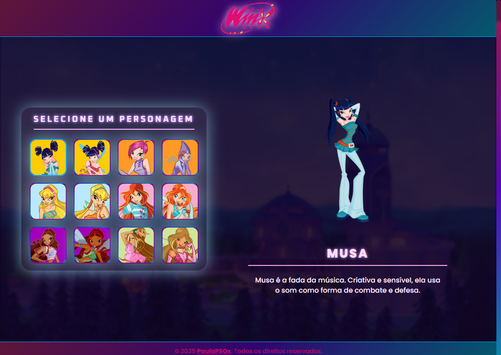

# 🌟🌈O Clube das Winx - Seleção de Fadas Mágicas✨🧚‍♀️

Este projeto é uma homenagem ao mundo encantado de **Winx Club**, onde os usuários podem visualizar as personagens principais em suas **versões civis** e **transformações mágicas** como fadas. Desenvolvido com **HTML**, **CSS** e **JavaScript**, o projeto recria a atmosfera mágica e colorida da série, proporcionando uma experiência envolvente e nostálgica para os fãs.

> Este projeto foi inspirado no desafio da comunidade [@Dev Em Dobro](https://github.com/devemdobro) e da **Guild Dev Em Dobro**, na semana da **Mapa Dev Week**.

---

## 📌 Acesse o Projeto

- 🔗 **Deploy (GitHub Pages)**: [visualizar o projeto paulapsox-o-clube-das-winx](https://paulapsox.github.io/o-clube-das-winx/)
- 📁 **Repositório no GitHub**: [https://github.com/paulaPSOx/o-clube-das-winx](https://github.com/paulaPSOx/o-clube-das-winx)

---

## ✨ Objetivo

Reviver a magia do universo **Winx**, apresentando suas personagens icônicas com suas transformações mágicas em uma interface interativa e visualmente encantadora.

---

## 🛠️ Tecnologias Utilizadas

- **HTML**: Estruturação do conteúdo.
- **CSS**: Estilização e visual encantado com brilho, transições e cores vibrantes.
- **JavaScript**: Interatividade para seleção de personagens e troca de visuais.

---

## 📁 Estrutura de Pastas

```
├── src
│   ├── css
│   │   └── style.css
│   ├── imagens
│   │   ├── cards
│   │   │   ├── aisha-winx.png
│   │   │   ├── bloom-winx.png
│   │   │   └── ...
│   │   ├── logotipo
│   │   │   └── logo-winx.png
│   │   ├── wallpaper
│   │   │   └── wallpaper (fundo).png
│   │   └── winx
│   │       ├── aisha.png
│   │       ├── bloom.png
│   │       └── ...
│   ├── js
│   │   └── index.js
├── index.html
├── background-winx-project.png
├── LICENSE
└── README.md
```

---

## 📄 Descrição dos Arquivos

- **style.css**: Estilos mágicos e animações brilhantes.
- **index.js**: Comportamento de interação e troca de personagens.
- **index.html**: Estrutura principal da página.
- **/imagens**: Contém imagens das personagens, logos e plano de fundo.

---

## 🌟 Funcionalidades

- ✅ Visualização das fadas em forma **civil** e **transformada**.
- ✅ **Interface colorida e mágica**, com transições suaves e responsividade.
- ✅ Design inspirado na estética da série original.
- ✅ Seleção de personagens com efeitos visuais encantadores.

---

## 📸 Capturas de Tela



---

## 🚀 Como Usar

1. Clone este repositório:
   ```bash
   git clone https://github.com/paulaPSOx/o-clube-das-winx
   ```

2. Navegue até a pasta do projeto:
   ```bash
   cd o-clube-das-winx
   ```

3. Abra o arquivo `index.html` no seu navegador preferido.

---

## 🧪 Testes

- ✅ Interaja com a seleção de personagens.
- ✅ Verifique se todas as imagens carregam corretamente.
- ✅ Teste a responsividade em diferentes tamanhos de tela.

---

## 🧚 Melhorias Futuras

- ✨ Adicionar efeitos sonoros mágicos.
- ✨ Inserir mais personagens (como Roxy e Daphne).
- ✨ Criar transições automáticas entre visual civil e mágico.
- ✨ Incluir glitter animado ou partículas flutuantes no fundo.

---

## 📝 Licença

Distribuído sob a licença **MIT**. Consulte o arquivo [LICENSE](./LICENSE) para mais detalhes.

---

## 🙏 Agradecimentos

Agradeço à comunidade [@Dev Em Dobro](https://github.com/devemdobro) e à **Guild Dev Em Dobro** pelo suporte, inspiração e recursos durante a **Mapa Dev Week**!

---

✨ Espero que você se encante com esse pedacinho do mundo mágico das **Winx**! ✨
